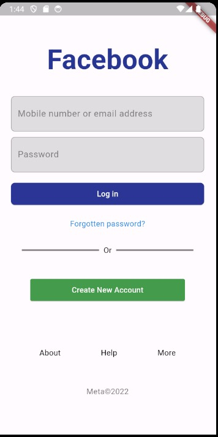

# FACEBOOK LOGIN UI

## About

Clone facebook ui using flutter

## Images



#### Tech

- [Flutter](https://expo.dev/)

### How to use?

To get started, you'll need to have a few tools installed on your machine:
[Git](https://git-scm.com), [NodeJS](https://nodejs.org/en/), and you'll also need an emulator. You can find more information on the [Android Studio](https://developer.android.com/studio?hl=pt&gclid=CjwKCAjw1ICZBhAzEiwAFfvFhHLSUJj_5oi2_iujE7QitCc9tE3BjT5DXG-ML2YkUK8BMkz1PWBtWxoCU58QAvD_BwE&gclsrc=aw.ds) you'll need a code editor such as
[VSCode](https://code.visualstudio.com/)

#### Open u cmd and paste this code:

```bash
# Para clonar o repositório:
$ git clone git@github.com:Av3z/FacebookLoginUI.git

# Entre na pasta do projeto:
$ cd facebook_login_ui

# Para instalar as dependencias digite:
$ npm install

# Para iniciar o projeto:
$ flutter run
